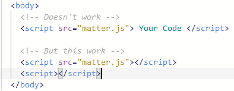
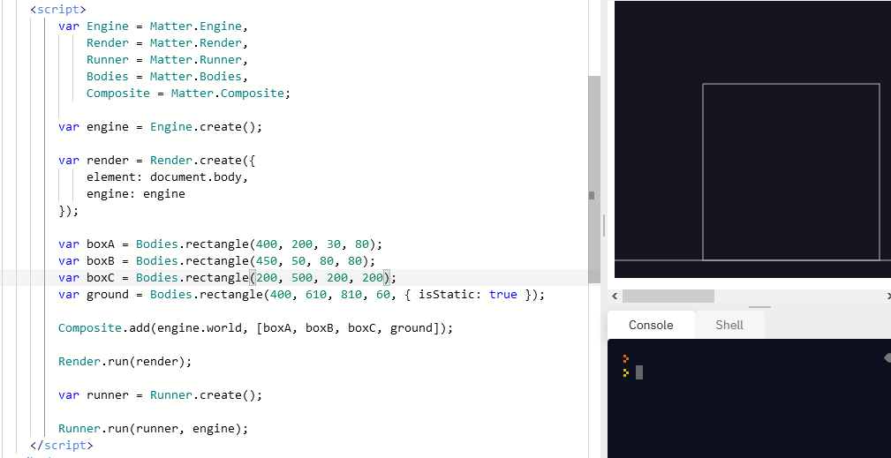

# Entry 4
##### X/X/XX

When this entry is compared to the last entry, the only sources that I really changed is the [video](https://www.youtube.com/watch?v=PsL3iI61wl8). The other [one](https://github.com/liabru/matter-js/wiki/Getting-started#install) remained the same as it is still my go to page when I don't get something
With both of them, I brought things to the proper path and started working on the basics of my project. Meaning I made founations of the project.

While messing with the code, it really help me learn about about html's script tags and how to use them. For a engine like Matter.js, you have to add it to a libaray and link it to your html. THEN you need to make another script tag and type your code in there, not inside the script tag that you defined the engine.

For example

Below is the code I tried is the very basic code that the engine's tutorial, but I mess around are tinkered with it like changing around the size of the shapes and even adding another shape into the mix. 

Like this

I used "Embracing failure" "How to Google", and "Debugging". I originally planned to use the previous video and the github page to help me set up my own engine rendering environment, but the video is rather not fitting compared to the website, and the code I created didn't work for a long time. So then I decided to ditch the video and keep the website. 
After a short break, I came back and used google to find a better video that is more fitting for my circumstances, and this help me debug my previous issues. 
Then I spent the next few hours focusing on messing and tickering with the code and learning from it. Especailly the connections of each line of code with other lines of code

[Previous](entry03.md) | [Next](entry05.md)

[Home](../README.md)